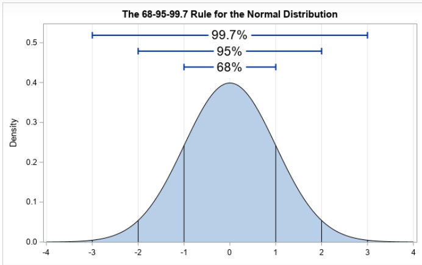
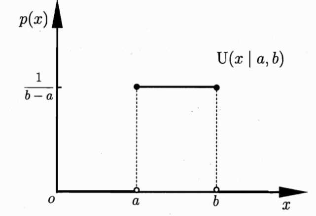
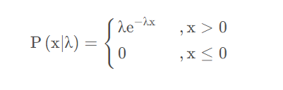
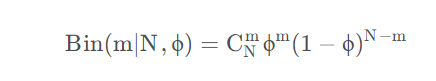
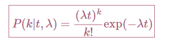
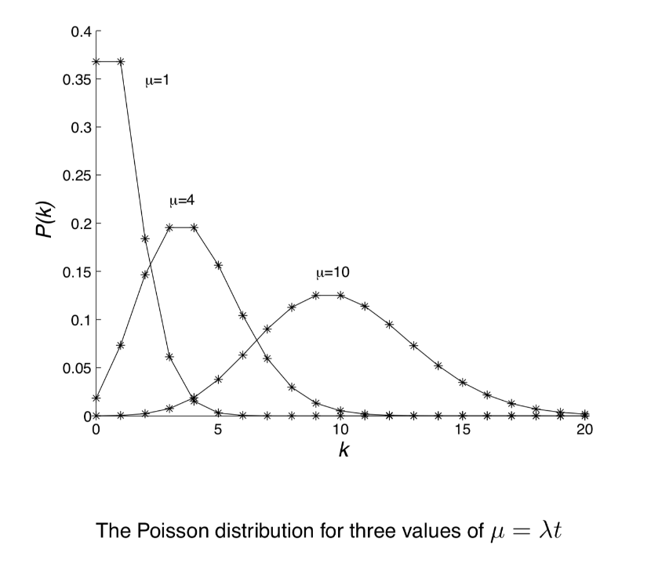

# 数据分布
数据分布指的是数据在不同取值上的频率或概率分布，它可以帮助我们了解数据的形状、中心趋势和离散程度。在统计学和数据分析中，了解你的数据分布类型是非常重要的，因为这将影响你选择哪种统计方法或机器学习模型。比如我们如果要使用KNN算法的时候，我们要要求数据服从正态分布

- 查看某一个数值型变量的分布，查看变量是否符合正态分布，如果不符合正太分布的变量可以log化后再观察下是否符合正态分布。
- 如果想统一处理一批数据变标准化 必须把这些之前已经正态化的数据提出
- 正态化的原因：一些情况下正态非正态可以让模型更快的收敛，一些模型要求数据正态（eg. GMM、KNN）,保证数据不要过偏态即可，过于偏态可能会影响模型预测结果
## 标准化与常见的变换方法
标准化（Normalization）是数据预处理中常用技术，它们在处理数据时服务于不同的目的，但可以相互补充，以改善模型的性能。

### 标准化（Normalization）

标准化是指将数据缩放到特定的范围内（如0到1之间）或调整数据使其分布具有特定的均值（通常为0）和标准差（通常为1）的过程。其主要目的是消除不同特征间量纲的差异，确保每个特征对模型的贡献度在相同的量级上。

**常见的标准化方法**：

- **最小-最大标准化**：将数据缩放到0和1之间。
- **Z得分标准化**：将数据转换为均值为0、标准差为1的分布。

### 对数变换（Logarithmic Transformation）

对数变换通过对数函数转换数据，常用于处理偏态分布的数据。该过程可以使偏斜的数据分布变得更加接近正态分布，有助于满足一些统计分析和机器学习模型对数据正态性的假设。

**对数变换的主要目的**：

- 减少数据的偏斜程度。
- 稳定数据的方差。
- 使数据分布更接近正态分布。
###  **Box-Cox变换**
Box-Cox变换是一种旨在将非正态分布的数据转换为近似正态分布的方法。这种变换依赖于参数λ（Lambda），通过找到最佳的λ值来确定最适合数据的变换方式。

- **应用场景**：适用于正值数据的正态化。
- **优点**：有效地稳定方差，减少数据偏斜，使模型预测更准确。
- **局限性**：仅适用于正数数据。

### **Yeo-Johnson变换**
Yeo-Johnson变换扩展了Box-Cox变换，允许对零或负值的数据进行变换，从而增加了应用的灵活性。

- **应用场景**：可以处理包括零和负值在内的数据，进行正态化处理。
- **优点**：比Box-Cox变换更通用，可以应对更广泛的数据类型。
- **局限性**：变换的复杂性较高，需要通过优化方法确定最佳的λ值。

### **平方根变换**
平方根变换通过对数据取平方根来减少偏斜和稳定方差，特别适用于正数和计数数据。

- **应用场景**：适用于偏斜的正数或计数数据。
- **优点**：操作简单，能有效减少数据的偏斜程度。
- **局限性**：对于含有零或负值的数据不适用。

###  **倒数变换**
倒数变换通过取数据的倒数来改善其分布特性，适用于数据间存在倒数关系的情况。

- **应用场景**：处理具有倒数关系的数据，如速度与时间。
- **优点**：能够简化模型，改善数据的线性关系。
- **局限性**

### 标准化和其他变换方法的关系

- **互补性**：对具有偏斜分布的特征，可以先使用其他的变换减少偏斜程度，再进行标准化，以满足模型的标准输入要求。
- **联合使用**：对于一些对输入数据分布敏感的算法（如线性回归、逻辑回归等），先对数据进行对数变换接近正态分布，然后进行标准化处理，可以改善模型的预测性能。
- **应用场景区别**：标准化主要用于满足特定模型的需求，对数变换则用于解决数据分布问题。选择哪种技术（或两者的组合）取决于数据的特性和建模目标。

## 数值型数据
### 连续型数值数据
连续型数据可以在一定范围内取任何值，例如体重、温度或者收入。这些数据可以进一步细分为均匀分布、正态分布等。
- **正态分布（高斯分布）**

数据呈对称的钟形曲线，许多自然和社会现象都近似服从这种分布，例如人的身高、血压等。

- **均匀分布**

在一定范围内，每个值出现的概率都相等，例如抛骰子的结果。

- **指数分布**

用于描述事件发生的时间间隔或者某些非负数值数据的分布，最大的特点就是无记忆性，例如人们到达银行柜台的时间间隔。

### 离散型数值数据
离散型数据只能取有限个或可数个值，例如人数、汽车的数量或者一个类别中的观测数量
- **二项分布**

描述固定次数的独立实验中成功次数的分布，如抛硬币实验。

- **泊松分布**

用于描述在固定时间或空间内发生某事件的次数，如某电话交换台接到的呼叫数。

## 非数值型数据
### 分类数据（Categorical Data）
- **名义数据**：没有顺序或等级之分的分类数据，例如血型、民族。
- 分类数据的处理常涉及使用独热编码（One-Hot Encoding）或标签编码（Label Encoding）将其转换为模型可用的数值形式。

### 顺序数据（Ordinal Data）
- 顺序数据既包含了分类的特征，又有自然的顺序，处理时既要考虑其分类特性，也要考虑顺序信息，常见的处理方式是将其映射为有序的整数。

